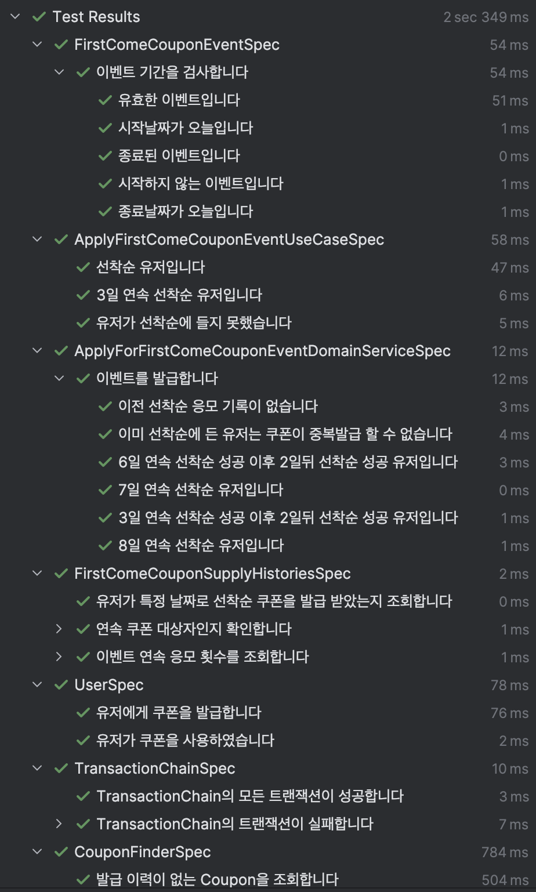
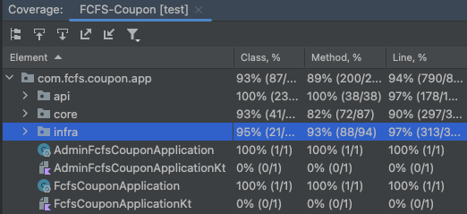
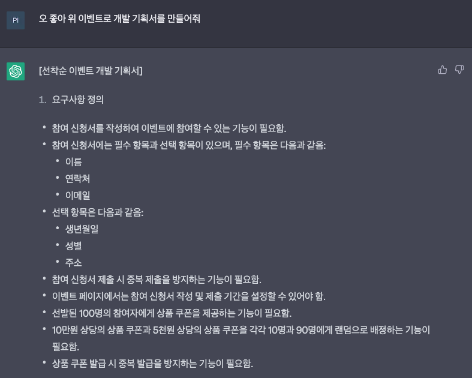

선착순 쿠폰 발행 프로젝트
---

선착순 이벤트로 쿠폰을 발행하는 프로젝트입니다.

간략한 요구사항 정의는 다음과 같습니다

### [선착순 이벤트 개발 기획서]

### 요구사항 정의
1. 유저는 이벤트에 참여할 수 있는 기능이 필요합니다.
2. 유저 정보에는 필수 항목과 선택 항목이 있습니다.
   - 필수 항목은 다음과 같음:
     - 이름
     - 연락처
     - 이메일
   - 선택 항목은 다음과 같음:
     - 생년월일
     - 성별
     - 주소
3. 유저는 같은 이벤트의 같은날의 선착순 이벤트를 한번만 참여할 수 있습니다.
4. 선발된 100명의 참여자에게 상품 쿠폰을 제공하는 기능이 필요함.
5. n원 부터 k원까지의 상품 쿠폰을 m명과 l명에게 랜덤으로 배정하는 기능이 필요합니다.
    - Ex) 10만원 상당의 상품 쿠폰과 5천원 상당의 상품 쿠폰을 각각 10명과 90명에게 랜덤으로 배정
6. 상품 쿠폰 발급 시 중복 발급을 방지하는 기능이 필요함.
7. 유저가 연속으로 3,5,7일 선착순에 들었을 경우 연속 이벤트 쿠폰을 제공합니다.
8. 연속 이벤트 쿠폰은 7일까지만 카운트 되며 7일 이후부터는 다시 1일부터 카운트 됩니다.

### 작성 API
#### App (port 9999)
이벤트 참여 API: 선착순 N명의 참여자에게 상품 쿠폰을 제공하는 API \
`POST /v1/firstcome/event/{id}`

쿠폰 발급 이력 조회 API : 쿠폰을 기준으로 발급 이력을 조회하는 API \
`GET /v1/user/coupon/history`

진행중인 이벤트 조회 API : 진행중인 이벤트를 조회하는 API \
`GET /v1/firstcome/event/in-progress`

#### Admin (port 9998)
쿠폰 발급 이력조회 API : 쿠폰을 기준으로 발급 이력을 조회하는 API \
`GET /v1/coupon/issue/{id}`

---
### 프로젝트 구조
해당 프로젝트는 모놀리식 아키텍쳐 + 멀티모듈을 사용하고있습니다.

각 모듈의 설명은 다음과 같습니다
- app : 애플리케이션의 주요 비즈니스 로직을 포함하는 모듈입니다.
- app-admin : 관리자용 API와 관련된 모듈입니다.
- app-api : app, app-admin 모듈의 config, Handler, response 등 공통 요소를 포함하는 모듈입니다.
- app-core : 도메인 로직과 서비스 인터페이스를 포함하는 모듈입니다.
- app-infra : 인프라스트럭처 관련 구현체를 포함하는 모듈입니다.

command와 query를 분리하여 CQRS 패턴을 적용하였습니다. \
분산 트랜잭션을 지원하기 위해 Saga 패턴이 적용된 [TransactionChain](https://github.com/picbel/FCFS-Coupon/blob/master/app-core/src/main/kotlin/com/fcfs/coupon/app/core/utils/transaction/TransactionChain.kt)이라는 객체를 자체 구현하였습니다. 

---
### Test Code
테스트 코드는 크게 3 가지 기준으로 작성되었습니다.
- Small: 단위테스트
    - 테스트 대상이 외부계층과 단절되어있습니다.
    - [바로가기](https://github.com/picbel/FCFS-Coupon/tree/master/app-core/src/test/kotlin/testcase/small/domain)
- Medium: 두개 이상의 계층 통신테스트
    - DB 등 테스트 대상의 외부 계층과 통신 그러나 외부 네트워크, 시스템과는 단절되어있습니다.
    - [바로가기](https://github.com/picbel/FCFS-Coupon/tree/master/app-infra/src/test/kotlin/testcase/medium/infra/domain/repository)
- Large: Api테스트,통합테스트
    - 외부에서 요청이 왔다는 가정하에 작성한 테스트입니다.
    - [바로가기](https://github.com/picbel/FCFS-Coupon/tree/master/app/src/test/kotlin/testcase/large)
> 테스트를 나눈 기준은 https://testing.googleblog.com/2010/12/test-sizes.html 를 참고하였습니다

테스트 실행 내역

테스트 Coverage는 다음과 같습니다. (24-11-24 기준) \

테스트 커버리지가 높다고 해서 반드시 좋은 테스트가 되는 것은 아니지만, \
테스트 케이스의 스펙 정의를 꼼꼼하게 작성했는지 여부를 평가하는 지표로서 고려될 수 있다고 생각합니다.

---

### 출처
 \
GPT가 만들어준 기획내용을 약간의 수정하였습니다.
