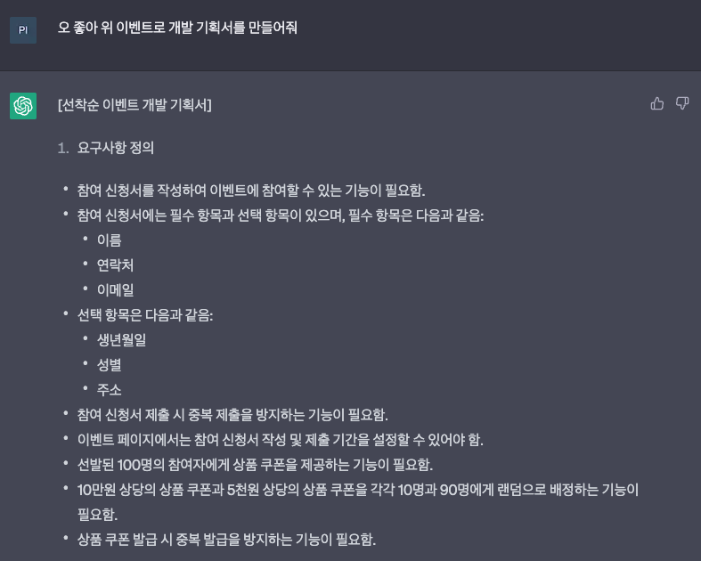

선착순 쿠폰 발행 프로젝트
---

선착순 이벤트로 쿠폰을 발행하는 프로젝트입니다.

간략한 요구사항 정의는 다음과 같습니다

### [선착순 이벤트 개발 기획서]

### 요구사항 정의
1. 유저는 이벤트에 참여할 수 있는 기능이 필요합니다.
2. 유저 정보에는 필수 항목과 선택 항목이 있습니다.
   - 필수 항목은 다음과 같음:
     - 이름
     - 연락처
     - 이메일
   - 선택 항목은 다음과 같음:
     - 생년월일
     - 성별
     - 주소
3. 유저는 같은 이벤트의 같은날의 선착순 이벤트를 한번만 참여할 수 있습니다.
4. 선발된 100명의 참여자에게 상품 쿠폰을 제공하는 기능이 필요함.
5. n원 부터 k원까지의 상품 쿠폰을 m명과 l명에게 랜덤으로 배정하는 기능이 필요합니다.
    - Ex) 10만원 상당의 상품 쿠폰과 5천원 상당의 상품 쿠폰을 각각 10명과 90명에게 랜덤으로 배정
6. 상품 쿠폰 발급 시 중복 발급을 방지하는 기능이 필요함.
7. 유저가 연속으로 3,5,7일 선착순에 들었을 경우 연속 이벤트 쿠폰을 제공합니다.
8. 연속 이벤트 쿠폰은 7일까지만 카운트 되며 7일 이후부터는 다시 1일부터 카운트 됩니다.

### 작성 API
이벤트 참여 API: 선착순 N명의 참여자에게 상품 쿠폰을 제공하는 API

---

프로젝트를 확인하시면 꼭! 테스트 코드를 확인해주세요.
제 코드 스타일을 확인하실 수 있습니다.

[TEST-README.md](src%2Ftest%2FREADME.md)

---

### 추후 추가 예정 API
진행 이벤트 리스트 API: 현재 진행중인 이벤트 목록을 조회할 수 있는 API

유저별 이벤트 참여 조회 API: 유저의 이벤트 이력 조회 API

### 출처
 \
GPT가 만들어준 기획내용을 약간의 수정하였습니다.