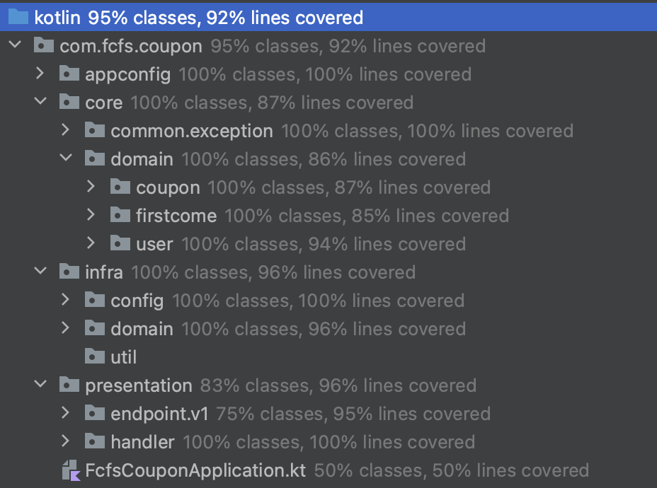

## README
### 프로젝트의 테스트 코드 설명글입니다.

테스트 코드는 크게 3 가지 기준으로 작성되었습니다.
- Small: 단위테스트
  - 테스트 대상이 외부계층과 단절되어있습니다.
- Medium: 두개 이상의 계층 통신테스트
  - localhost나 Thread, DB 등 테스트 대상의 외부 계층과 통신 그러나 외부 네트워크, 시스템에 접근이 제한됩니다.
- Large : Api테스트,통합테스트
  - 외부에서 요청이 왔다는 가정하에 작성한 테스트입니다.

테스트 Coverage는 다음과 같습니다.

테스트 커버리지가 높다고 해서 반드시 좋은 테스트가 되는 것은 아니지만, \
테스트 케이스의 스펙 정의를 꼼꼼하게 작성했는지 여부를 평가하는 지표로서 고려될 수 있다고 생각합니다.

#### 테스트 실행.gif

